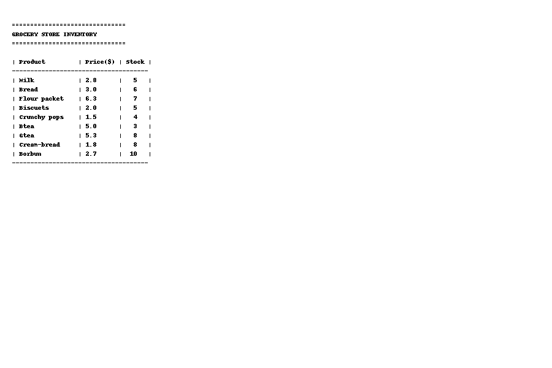

# GROCERY-STORE-USING-LISTS
A simple grocery inventory program in Python that displays products, prices, and stocks. It also allows updating prices, updating stock, and deleting products.

## Screenshot

